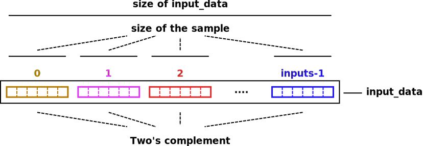

entity scopeio
==============

.. comment: .. raw:: html
    <object with="80" data="input_data.svg" type="image/svg+xml"></object>

generic
-------

=================== ================ ============== ===========================
Parameter           Type             Default        Description
=================== ================ ============== ===========================
:ref:`inputs`       natural          1              Number of channel inputs
:ref:`input_preamp` real_vector                     Analog input Preamplifier  
:ref:`layout_id`    natural          0              Display layouts 
:ref:`vt_div`       std_logic_vector b"0_001_00000" Vertical division unit
:ref:`ht_div`       std_logic_vector b"0_001_00000" Horizontal division unit
:ref:`vt_scales`    scale_vector                    Vertical scale descriptor
:ref:`hz_scales`    scale_vector                    Horizontal scale descriptor 
:ref:`gauge_labels` std_logic_vector                Gauge labels
:ref:`unit_symbols` std_logic_vector                Unit Symbols
:ref:`channels_fg`  std_logic_vector                Channel foreground colors
:ref:`channels_bg`  std_logic_vector                Channel background colors
:ref:`hzaxis_fg`    std_logic_vector                Horzontal foreground color
:ref:`hzaxis_bg`    std_logic_vector                Horzontal background color
:ref:`grid_fg`      std_logic_vector                Grid foreground colors
:ref:`grid_bg`      std_logic_vector                Grid background colors
=================== ================ ============== ===========================

.. _inputs:

inputs
~~~~~~

The number of channel inputs which scopeio is going to plot.

.. _input_preamp:

input_preamp
~~~~~~~~~~~~

This parameter is required to set the analog inputs when to have different scales. If all the inputs have the same voltage resolution, assing 

input_preamp => (0 to number_of_inputs-1 => 1.0)

.. _layout_id:

layout_id
~~~~~~~~~

layout_id selects one of the two display layouts. The table below shows the parameter's value to set according to the resolution required.

===== ========== ===============
Value Resolution Video frequency
===== ========== ===============
    0  1920x1080         150 MHz
    1    800x600          40 MHz
===== ========== ===============

There is a nano-windows in which others layouts can be described pretty easily. So far, there are only two.

.. _vt_div:

vt_div
~~~~~~

It represents the vertical base division. The least five significant bits represent the binary point. The default value b"0_001_00000" means 1.00000.

.. _ht_div:

ht_div
~~~~~~

It represents the horizontal base division. The least five significant bits represent the binary point. The default value b"0_001_00000" means 1.00000.

.. _vt_scales:

vt_scales
~~~~~~~~~

It describes the vertical scales using vt_div as base to display the value on the screen.

.. _hz_scales:

hz_scales
~~~~~~~~~

It describes the horizontal scales using ht_div as base to display the value on the screen.

.. _gauge_labels:

gauge_labels
~~~~~~~~~~~~

The labels that are going to be displayed describing the reading.

.. _unit_symbols:

unit_symbols
~~~~~~~~~~~~

Unit symbols that readings are about. One character per reading.

.. _channels_fg:

channels_fg
~~~~~~~~~~~

The color which input channels are going to be plot

.. _channels_bg:

channels_bg
~~~~~~~~~~~

The background color with which readings are associated

.. _hzaxis_fg:

hzaxis_fg
~~~~~~~~~

The foreground color which the horizontal axis is going to be plot

.. _hzaxis_bg:

hzaxis_bg
~~~~~~~~~

The background color with which the horizontal axis is going to be plot

.. _grid_fg:

grid_fg
~~~~~~~

The foreground color which the grid is going to be displayed

.. _grid_bg:

grid_bg
~~~~~~~

The background color which the grid is going to be displayed

port
----

=================== ==== ================ =============== ================================
port                Mode Type             Default         Description
=================== ==== ================ =============== ================================
:ref:`mii_rxc`      in   std_logic                        Ethernet PHY receive clock
:ref:`mii_rxdv`     in   std_logic                        Ethernet PHY receive data valid
:ref:`mii_rxd`      in   std_logic_vector                 Ethernet PHY receive data 
:ref:`tdiv`         out  std_logic_vector                 
:ref:`channel_ena`  in   std_logic_vector (others => '1') Channel output Enable
:ref:`input_clk`    in   std_logic                        Input Channel Clocks
:ref:`input_ena`    in   std_logic                        Input Channel Enable
:ref:`input_data`   in   std_logic_vector                 Input Channel Samples
:ref:`video_clk`    in   std_logic                        Video Clock
:ref:`video_rgb`    out  std_logic_vector                 Video Pixel RGB
:ref:`video_vsync`  out  std_logic                        Video Vertical Sync
:ref:`video_hsync`  out  std_logic                        Video Horizontal Sync
:ref:`video_blank`  out  std_logic                        Video Blank
:ref:`video_sync`   out  std_logic                        Video Sync
=================== ==== ================ =============== ================================

.. _mii_rxc:

mii_rxc
~~~~~~~

Ethernet phy receive clock

.. _mii_rxdv:

mii_rxdv
~~~~~~~~

Ethernet phy received data valid clock. Connect it to mii phy

.. _mii_rxd:

mii_rxd
~~~~~~~

Ethernet phy received data clock. Connect it direct to FPGA corresponding mii phy

.. _tdiv:

tdiv
~~~~

Ethernet phy received data clock. Connect it direct to FPGA corresponding mii phy

.. _channel_ena:

channel_ena
~~~~~~~~~~~

Enable the corresponing channel to be plotted

.. _input_clk:

input_clk
~~~~~~~~~

Input sample data clock

.. _input_ena:

input_ena
~~~~~~~~~

Enable input sample data

.. _input_data:

input_data
~~~~~~~~~~

Input sample data

.. _video_clk:

video_clk
~~~~~~~~~

Video dot clock

.. _video_rgb:

video_rgb
~~~~~~~~~

Video output pixel

.. _video_vsync:

video_vsync
~~~~~~~~~~~

Vertical sync output

.. _video_hsync:

video_hsync
~~~~~~~~~~~

Horizontal sync output

.. _video_blank:

video_blank
~~~~~~~~~~~

Video blank

.. _video_sync:

video_sync
~~~~~~~~~~

Video sync signal
