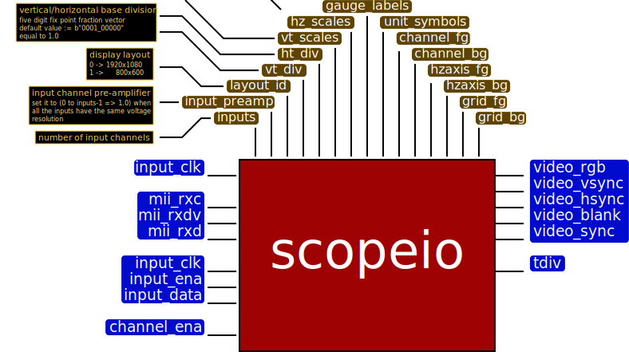
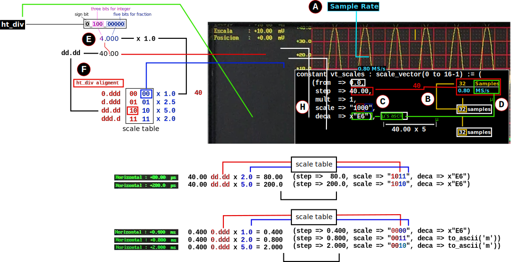
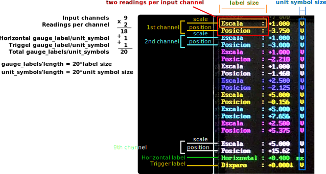

entity scopeio
==============

   scopeio entity block diagram

generic
-------

=================== =================== ============== ===========================
Parameter           Type                Default        Description
=================== =================== ============== ===========================
:ref:`inputs`       natural             1              Number of channel inputs
:ref:`input_preamp` real_vector                        Analog input Preamplifier  
:ref:`layout_id`    natural             0              Display layouts 
:ref:`vt_div`       std_logic_vector    b"0_001_00000" Vertical division unit
:ref:`hz_div`       std_logic_vector    b"0_001_00000" Horizontal division unit
:ref:`vt_scales`    :ref:`scale_vector`                Vertical scale descriptor
:ref:`hz_scales`    :ref:`scale_vector`                Horizontal scale descriptor 
:ref:`gauge_labels` std_logic_vector                   Gauge labels
:ref:`unit_symbols` std_logic_vector                   Unit Symbols
:ref:`channels_fg`  std_logic_vector                   Channel foreground colors
:ref:`channels_bg`  std_logic_vector                   Channel background colors
:ref:`hzaxis_fg`    std_logic_vector                   Horzontal foreground color
:ref:`hzaxis_bg`    std_logic_vector                   Horzontal background color
:ref:`grid_fg`      std_logic_vector                   Grid foreground colors
:ref:`grid_bg`      std_logic_vector                   Grid background colors
=================== =================== ============== ===========================

.. _inputs:

inputs
~~~~~~

The number of channel inputs which scopeio is going to plotted.

.. _input_preamp:

input_preamp
~~~~~~~~~~~~

This parameter is required to be set when the analog inputs have different
volatge resolution. If all the inputs have the same resolution respect to 
each other, set it to (0 to inputs-1 => 1.0)

.. _layout_id:

layout_id
~~~~~~~~~

:ref:`layout_id` selects one of the two display layouts. The table below shows
the parameter values to be set, according to the video resolution required.

===== ========== ===============
Value Resolution Video frequency
===== ========== ===============
    0  1920x1080         150 MHz
    1    800x600          40 MHz
===== ========== ===============

There is a nano-window system in which other layouts can be described pretty
easily. So far, there are only two.

.. _vt_div:

vt_div
~~~~~~

It is a std_logic_vector that represents the vertical base division. 
It is composed of:

    - one sign bit,
    - three integer bits and
    - five fraction bits.
      
The default value is b"0_001_00000" and means 1.000 in decimal.  See
:ref:`vt_scales` for more explanation.

.. _hz_div:

hz_div
~~~~~~

It is a std_logic_vector that represents the horizontal base division. 
It is composed of:

    - one sign bit,
    - three integer bits and
    - five fraction bits.
      
The default value is b"0_001_00000" and means 1.000 in decimal.  See
:ref:`hz_scales` for more explanation.

.. _vt_scales:

vt_scales
~~~~~~~~~

:ref:`vt_scales` is a sixteen-element vector whose elements are :ref:`scale_t`
records. Each one describes one of the sixteen vertical scales using
:ref:`vt_div` as a base to display the corresponding values on the screen. The
steps to set up each element of the :ref:`vt_scales` are the following - see
:ref:`vt_scales-figure` -.

.. _vt_scales-figure:

   :ref:`vt_scales` setup example
  
- A
    Get the resolution and input range of the ADC into which the signal is
    going to be converted. In the example those parameters are 16 bits and 1 V
    respectively. Select the desired Vertical Division which in the example is
    10 mV.

- B
    Calculate the value of the :ref:`mult` member by multiplying:

    - the input range of the ADC. In the example this 1 V by
    - 32, because there are 32 pixels per division by
    - 2 to the power of 18, in which 18 is the width of the FPGA multiplier.

    and devide it by:

    - the Vertical Voltage division. In the example 10 mV, and by
    - 2 to the power of the resolution of the ADC.  In the example is 16.
        
    Following the example, :ref:`mult` is the result of (1 V x 32 x 2**18)/(10 mV x 2**16).

- C
    - Set the record member :ref:`from` to 7 times the selected Vertical
      Division. According to the example: this is 7 x 10.00.
    - Set :ref:`step` member to the negative value of the selected vertical
      division.  This is -10 in the example.
    - Set :ref:`deca` member to the ascii code of the selected factor of the
      vertical division.

- D
    The :ref:`vt_div` parameter is composed of:

    - five fraction bits,
    - three integer bits 
    - and one sign bit.
      
    Three integer bits mean that integer part of :ref:`vt_div` can represent
    one decimal digit only. The vertical base division must be aligned
    according to that.

    Following the example: the result of the vertical base division is 10.00.
    To fit it in :ref:`vt_div`, the decimal point should be shifted one
    position to the left to get the one-decimal-digit-only integer part. The
    new value, then, is 1.000, and the corresponding binary representation is
    0_100_00000 in which the first '_' character separates the sign bit, and
    second one separates the fraction bits.

- E
    Once the correct value is selected for :ref:`vt_div`, the record member
    :ref:`scale` should be set according to the scale table to display the
    correct vertical division value on the screen. The :ref:`scale` member is a
    four bit vector whose two left bits shift the decimal point while the right
    two bits select a number from: 1.0, 2.5, 5.0 or 2.0; which multiplies
    ref:`vt_div`. 

    In the example, the two left bits are "10" which shift the decimal point
    one place to the right and the two right bits are "00" which multiply the
    by 1.0.  Being the decimal representation of :ref:`vt_div` 1.000, the value
    to be displayed will be 10.00.

- F
    Check the examples in the corresponding figure. 

.. _hz_scales:

hz_scales
~~~~~~~~~

:ref:`hz_scales` is a sixteen-element vector whose elements are :ref:`scale_t`
records. Each one describes one of the the sixteen horizontal scales using
:ref:`hz_div` as a base to display the corresponding values on the screen. The
steps to set up each element of :ref:`hz_scales` are the followings: - see
:ref:`hz_scales-figure` -.

.. _hz_scales-figure:

.. figure:: hzscale_vector.svg
   :target: images/hzscale_vector.svg
  
   :ref:`hz_scales` setup example

- A
    Choose the sample rate: in the exmaple it is 800 KS/s

- B
    The base division is gotten dividing 32 by the sample rate as each division
    is 32-pixel wide. In the example the result is 40 us as the sample rate
    selected 0.8 MS/s 

- C
    Set the record member :ref:`step` to the base division value gotten before.
    :ref:`step` only controls the increment of the horizontal axis marks.
    In the example is 40.00.

- D
    Get the corresponding ascii code of the factor character and set it to
    :ref:`deca`. In the example: the corresponding factor is micro.

- E
    The :ref:`hz_div` parameter is composed of:

    - Five fraction bits.
    - Three integer bits.
    - One sign bit. 

    Three integer bits mean that integer part of :ref:`hz_div` must be one
    decimal digit only. The horizontal base division must be aligned according
    to that. Following the example: The result of the horizontal base division
    is 40.00. To fit it in :ref:`hz_div`, the decimal point should be shifted
    one position to the left to get the one-decimal-digit-only integer part.
    The new value, then, is 4.000, and the corresponding binary representation
    is 0_100_00000 in which the first '_' charater separates the sign bit and
    second one separates the fraction bits.  

F
    Once the correct value is selected for :ref:`hz_div`, the record member
    :ref:`scale` should be set, according to the scale table to display the
    correct horizontal division value on the screen. The :ref:`scale` member is
    a four bit vector whose two left bits shift the decimal point while the
    right two bits select a number from: 1.0, 2.5, 5.0 or 2.0; which multiplies
    ref:`vt_div`. 

G
    Set the record member :ref:`mult` according to the required downsampling.
    if the downsampling is going to be made by multiplexing the input channel
    of ADCs set it to 1. Use :ref:`tdiv` to know which scale has been selected
    by the user.

H
    Check the examples. There, :ref:`from` is set to 0.0 and :ref:`mult` should
    be set as it is decribed on G.

.. _gauge_labels:

gauge_labels
~~~~~~~~~~~~

The labels that are going to be displayed describing the reading. The parameter
is a string whose value is a catenation of all of the reading labels. All
labels should be the same size long. There are two readings per input channel,
plus the horizontal division reading and tigger reading.

In the :ref:`gauge_labels-figure` there are nine input channels, therefore the
total number of labels is twenty. 

.. _gauge_labels-figure:

  
   :ref:`gauge_labels` example

.. _unit_symbols:

unit_symbols
~~~~~~~~~~~~

Each reading has its own unit symbol. As :ref:`gauge_labels`, it is a a string
whose value is catenation of the reading units and each one should be the same
size long. As mention, in :ref:`gauge_labels`, there are two readings per input
channel plus the horizontal division reading and the trigger reading.  Also,
all the ref:`unit_symbols` should be the same size long. In the
:ref:`gauge_labels-figure` the total number of :ref:`unit_symbols` is twenty
and all of them are one character length.

.. _channels_fg:

channels_fg
~~~~~~~~~~~

It is the colors which each input channels will be plotted and its
corresponding reading will be printed. The parameter is a std_logic_vector
whose value is the catenation of all of the input color words. There shoud be
as many color words as there are :ref:`inputs`. See the
:ref:`channel_fg-description`

.. _channel_fg-description:

.. figure:: channel_fg.svg
   :target: images/channel_fg.svg

   :ref:`channels_fg` description figure

.. _channels_bg:

channels_bg
~~~~~~~~~~~

It is the background colors which each reading is going to be print. The
parameter is a std_logic_vector whose value is the catenation of all of the
background color word.  There shoud be as many color words as there are
:ref:`inputs`. See the :ref:`channel_bg-description`

.. _channel_bg-description:

.. figure:: channel_bg.svg
   :target: images/channel_bg.svg

   :ref:`channels_bg` description figure

.. _hzaxis_fg:

hzaxis_fg
~~~~~~~~~

It is the foreground color which the horizontal axis and its corresponding
reading will be printed.

.. _hzaxis_bg:

hzaxis_bg
~~~~~~~~~

It is the background color which the horizontal axis and its corresponding
reading will be printed

.. _grid_fg:

grid_fg
~~~~~~~

It is the foreground color which the grid will be displayed.

.. _grid_bg:

grid_bg
~~~~~~~

It is the background color which the grid will be displayed.

port
----

=================== ==== ================ =============== ================================
port                Mode Type             Default         Description
=================== ==== ================ =============== ================================
:ref:`mii_rxc`      in   std_logic                        Ethernet PHY receive clock
:ref:`mii_rxdv`     in   std_logic                        Ethernet PHY receive data valid
:ref:`mii_rxd`      in   std_logic_vector                 Ethernet PHY receive data 
:ref:`tdiv`         out  std_logic_vector                 
:ref:`channel_ena`  in   std_logic_vector (others => '1') Channel output Enable
:ref:`input_clk`    in   std_logic                        Input Channel Clocks
:ref:`input_ena`    in   std_logic                        Input Channel Enable
:ref:`input_data`   in   std_logic_vector                 Input Channel Samples
:ref:`video_clk`    in   std_logic                        Video Clock
:ref:`video_rgb`    out  std_logic_vector                 Video Pixel RGB
:ref:`video_vsync`  out  std_logic                        Video Vertical Sync
:ref:`video_hsync`  out  std_logic                        Video Horizontal Sync
:ref:`video_blank`  out  std_logic                        Video Blank
:ref:`video_sync`   out  std_logic                        Video Sync
=================== ==== ================ =============== ================================

.. _mii_rxc:

mii_rxc
~~~~~~~

It is the receiving input clock to connect directly to the ethernet phy.

.. _mii_rxdv:

mii_rxdv
~~~~~~~~

It is the input data valid to connect directly to the ethernet phy.

.. _mii_rxd:

mii_rxd
~~~~~~~

It is an unconstraint std_logic_vector input data of the ethernet phy. The
first element of the vector is at the left. They are connected directly to the
ethernet phy.

.. _tdiv:

tdiv
~~~~

It is the user selected horizontal scale. It can be used to do the downsampling
externally by multiplexing analog ADC inputs. It can be left open.

.. _channel_ena:

channel_ena
~~~~~~~~~~~

It is a std_logic_vector. Each element enables the plotting of the corresponing
channel. Its default value is (0 to :ref:`inputs`-1 => '1').

.. _input_clk:

input_clk
~~~~~~~~~

It is the input sampling data clock.

.. _input_ena:

input_ena
~~~~~~~~~

It enables the acquisition of input-sample data. It can be used with serial
analog digital converters.

.. _input_data:

input_data
~~~~~~~~~~

It is a std_logic_vector whose value is the catenation of all of the
input sample data word. There shoud be as many words as there are
:ref:`inputs`. See the :ref:`input_data-figure`.

.. _input_data-figure:

.. figure:: input_data.svg
   :target: images/input_data.svg

   :ref:`input_data` description

.. _video_clk:

video_clk
~~~~~~~~~

It is the video dot clock. It should be configure as the desired video :ref:`layout_id`.

.. _video_rgb:

video_rgb
~~~~~~~~~

It is the video output pixel word. Its size should be the same as the words used
to describe all the other colors and depends on the hardware video output.

.. _video_vsync:

video_vsync
~~~~~~~~~~~

It is the vertical synchronization output.

.. _video_hsync:

video_hsync
~~~~~~~~~~~

It is the horizontal synchronization output.

.. _video_blank:

video_blank
~~~~~~~~~~~

It is an active low signal that indicates the video blank output. It is used by
some video DACs. It can be left open.

.. _video_sync:

video_sync
~~~~~~~~~~

It is the video synchronization output. It is used by some video DACs. It can
be left open.

